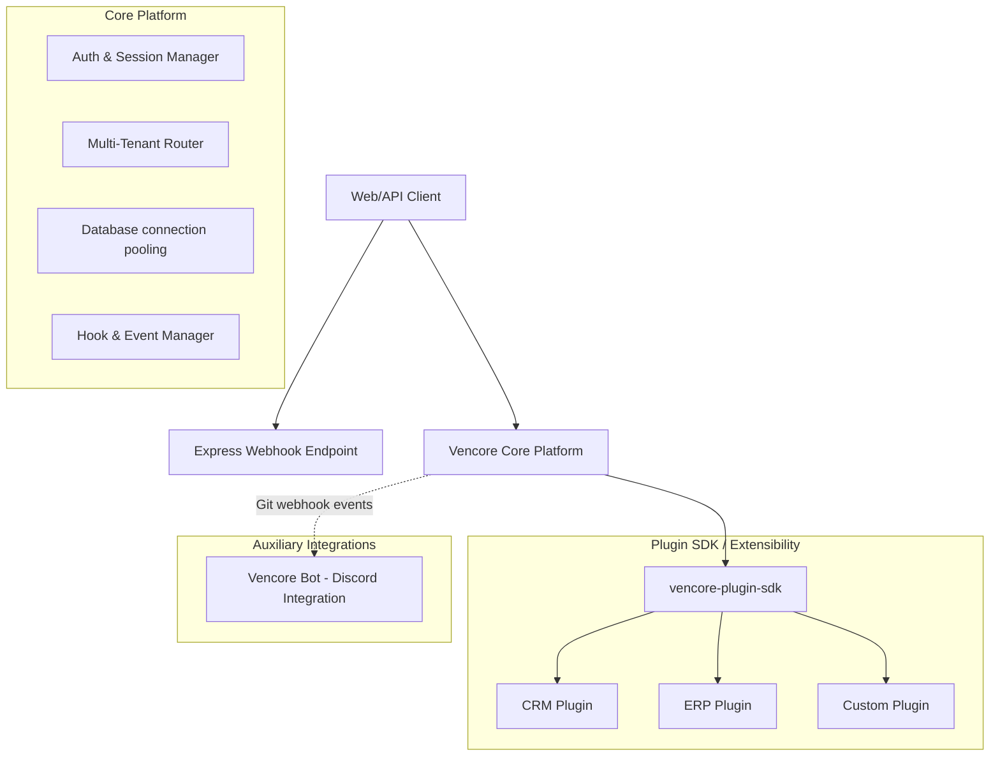

# Vencore Architecture Guide

This document provides a high-level overview of Vencore's design principles, components, and directory layouts to guide contributors and plugin developers.

---

## 1. High-Level Overview

Vencore is built as a **modular, plugin-first business platform**. Its main design goal is white-label flexibility: the core handles common application plumbing, while all business logic is encapsulated in hot-pluggable modules.

---

## 2. Core Architecture Pillars

### A. Plugin-First Extensibility
The core platform is intentionally thin. Business features (e.g., invoices, tasks, CRM, contacts) are implemented as self-contained plugins using `vencore-plugin-sdk`.
Plugins interact with the platform by:
* Registering routes (`GET`, `POST`, etc.) via SDK hooks.
* Defining database tables and migrations.
* Subscribing to core events (e.g., `user.created`, `tenant.updated`).
* Injecting UI components into pre-defined layouts.

### B. Multi-Tenancy & White-Labeling
Vencore supports logical multi-tenancy. A single platform instance runs multiple client portals, each with its own:
* Subdomain / Custom Domain
* Theme and Branding stylesheet
* Active plugins list
* Dedicated organizational structure and user privileges

### C. Bot & ChatOps Synchronization
The `vencore-bot` acts as a background coordinator. It:
1. Connects to Discord servers.
2. Manages developer assignments using Discord Modals, select menus, and thread-based forums.
3. Synchronizes local task databases (tissues) to GitHub issues using secure webhooks.

---

## 3. Directory Layouts

For details on individual projects, check their respective repositories:
* **[Vencore](https://github.com/vencorehq/Vencore)**: Core engine, router, authentication, and layout wrapper.
* **[vencore-platform](https://github.com/vencorehq/vencore-platform)**: Frontend controls, white-label configs, and tenant management dashboards.
* **[vencore-plugin-sdk](https://github.com/vencorehq/vencore-plugin-sdk)**: Type declarations, helper utils, and injection points for plugins.
* **[vencore-bot](https://github.com/vencorehq/vencore-bot)**: Discord application daemon running on Node/TypeScript.

---

## 4. Contributing
When modifying platform components, ensure that:
1. API endpoints in the core remain clean of plugin-specific logic.
2. Database migrations are reverse-compatible.
3. Event payloads defined in the SDK are strictly typed.
